<div align="center">

# 🌐 Language Translator & Patent Translation API

### A Flask REST Platform for Multilingual Text and Patent Metadata Translation

**Detect language → Translate text → Enrich patent metadata with English equivalents.**

[](https://www.python.org/)
[](https://flask.palletsprojects.com/)
[]()
[]()

<br>

[Overview](#-overview) • [Problem](#-problem-statement) • [Features](#-features) • [Coverage](#-supported-patent-fields) • [API](#-api-endpoints) • [Architecture](#-architecture) • [Stack](#-technology-stack) • [Setup](#-getting-started) • [Roadmap](#-future-roadmap)

</div>

<br>

---

## 📖 Overview

This is a **Flask-based translation platform** offering language detection, text translation, and patent metadata translation through a clean REST API.

The project initially started as a language detection and translation API and was later extended to support multilingual patent metadata translation retrieved from the **Wissen Research Patent API** — making patent records readable in English without discarding the original source data.

<table>
<tr>
<td width="50%" valign="top">

### 🗣️ Language Translation
Detects the language of any input text and translates it into English, returning a confidence score and validation feedback alongside the result.

</td>
<td width="50%" valign="top">

### 📜 Patent Translation
Retrieves patent records from the Wissen Research Patent API and enriches them with English translations of names, titles, citations, and legal events — while preserving the original metadata.

</td>
</tr>
</table>

> 💡 **Scope note:** Text translation and patent metadata translation are fully implemented and live behind REST endpoints. PDF translation, batch processing, and cloud deployment are planned — see [Future Roadmap](#-future-roadmap).

---

## 🧩 Problem Statement

Patent datasets span jurisdictions where metadata is rarely filed in English:

<div align="center">

| 🇨🇳 Chinese | 🇯🇵 Japanese | 🇰🇷 Korean | 🇪🇺 European | 🌐 International |
|:---:|:---:|:---:|:---:|:---:|

</div>

Titles and abstracts are sometimes available in English — but critical fields almost never are:

- Inventor names
- Assignee names
- Applicant names
- Citation records
- Legal event records
- Non-Patent Literature (NPL) citations

This is a real obstacle for **patent analysts, IP professionals, researchers, data scientists,** and **patent search platforms** trying to work across jurisdictions. This project automates that translation layer while preserving the original response structure underneath.

---

## ⚙️ How It Works

```mermaid
flowchart LR
    A([Patent ID]) --> B[Patent Retrieval]
    B --> C[Metadata Extraction]
    C --> D[Field Identification]
    D --> E[Translation Processing]
    E --> F[Metadata Enrichment]
    F --> G[Response Reconstruction]
    G --> H([JSON API Response])

    style A fill:#0B1F33,stroke:#1A73E8,stroke-width:2px,color:#fff
    style H fill:#0B1F33,stroke:#14B8A6,stroke-width:2px,color:#fff
    style E fill:#1A73E8,stroke:#0B1F33,stroke-width:2px,color:#fff
    style F fill:#14B8A6,stroke:#0B1F33,stroke-width:2px,color:#fff
```



---

## ✨ Features

### 🗣️ Language Translation
- Automatic language detection
- Translation into English
- Confidence score reporting
- Input validation:
  - Empty text validation
  - Numeric-only input validation
  - Special-character validation
- Short text warnings
- Ambiguous language detection warnings
- REST API support

### 📜 Patent Translation
- Patent retrieval from the Wissen Research Patent API
- Patent title translation
- Applicant translation
- Inventor translation
- Assignee translation
- Forward citation translation
- Backward citation translation
- Citation family translation
- Forward citation assignee list translation
- NPL citation title translation
- Legal event owner-name translation (when translatable fields are present)
- Preservation of original patent metadata
- Preserves original response ordering, so translated fields (e.g. `english_title`) appear directly alongside their source field (`title`) rather than appended separately
- Non-destructive metadata enrichment — original fields are never overwritten or removed
- Environment-based external API configuration
- Enriched, multilingual-aware patent responses

### 🧠 Translation Framework
- Generic **field** translation architecture
- Generic **list** translation architecture
- Reusable translation mappings
- Service-based processing pipeline
- Easily extensible translation workflow

---

## 🗂️ Supported Patent Fields

<div align="center">

| Category | Fields |
|---|---|
| **Direct Fields** | `title` · `applicant` |
| **List Fields** | `inventors` · `assignees` · `forward_citation_assignees` |
| **Nested Records** | `forward_citations` · `backward_citations` · `forward_citations_family` · `backward_citations_family` · `legal_events` · `npl_citation` |

</div>

---

## 🔌 API Endpoints

### 🔤 Text Translation

**`POST /api/translate`**

<table>
<tr><th width="50%">Request</th><th width="50%">Response</th></tr>
<tr>
<td>

```json
{
  "text": "こんにちは"
}
```

</td>
<td>

```json
{
  "success": true,
  "data": {
    "detected_language":
      "Japanese (100.0% confidence)",
    "translated_text": "Hello"
  }
}
```

</td>
</tr>
</table>

---

### 📄 Patent Translation

**`GET /api/patent/<patent_id>`**

```http
GET /api/patent/JP4819386B2
```

*Supported patent authorities depend on the coverage of the upstream patent API.*

**Returns:**
- Original patent metadata
- English patent title
- English applicant
- English inventors
- English assignees
- English citation assignees
- English NPL citation titles
- English legal event owner names (when present)

---

## 🏗️ Architecture

The application follows a clean **Route → Service → Config** layering:

<table>
<tr>
<td width="33%" valign="top">

#### 🛣️ Routes Layer
Handles:
- HTTP request handling
- Input validation
- API responses

**Modules:**
`web_routes.py`
`translate_routes.py`
`patent_routes.py`

</td>
<td width="33%" valign="top">

#### ⚡ Services Layer
Handles:
- Translation logic
- Patent processing logic
- Data transformation
- Metadata enrichment

**Modules:**
`translator_service.py`
`patent_service.py`

</td>
<td width="33%" valign="top">

#### ⚙️ Configuration Layer
Handles:
- Patent API URLs
- Future API keys
- Deployment configuration

**Via:** `.env`

</td>
</tr>
</table>

---

## 📂 Project Structure

```
lang-translator/
│
├── app.py                       # Application entry point
│
├── routes/
│   ├── web_routes.py            # Web/UI-facing routes
│   ├── translate_routes.py      # Text translation endpoints
│   └── patent_routes.py         # Patent translation endpoints
│
├── services/
│   ├── translator_service.py    # Language detection and translation engine
│   └── patent_service.py        # Patent metadata enrichment and translation utilities
│
├── templates/                   # HTML templates
├── static/                      # Static assets
├── .env                         # Environment configuration (not committed)
├── requirements.txt
├── README.md
└── API_DOCS.md
```

---

## 🧰 Technology Stack

<div align="center">

| Layer | Technologies |
|---|---|
| **Backend** | Python · Flask |
| **Translation** | Deep Translator · Google Translate |
| **Language Detection** | LangDetect |
| **API Integration** | Requests |
| **Data Processing** | JSON · Ordered field serialization (`OrderedDict`) |

</div>

---

## 🎯 Scalability Goals

- 🌍 Support additional patent metadata fields
- 🧩 Add configurable translation mappings
- 🔁 Support multiple translation providers
- 📄 Translate full patent documents
- 📑 Translate patent PDFs
- ☁️ Deploy as a cloud-hosted API
- 🚀 Support high-volume patent processing

---

## 🚀 Getting Started

### Clone the repository

```bash
git clone https://github.com/mehak-chopra/lang-translator.git
cd lang-translator
```

### Create a virtual environment

```bash
python -m venv venv
source venv/bin/activate   # On Windows: venv\Scripts\activate
```

### Install dependencies

```bash
pip install -r requirements.txt
```

### Configure environment variables

Create a `.env` file in the project root:

```env
PATENT_API_BASE_URL=https://api.example.com
```

### Run the application

```bash
python app.py
```

---

## 🗺️ Future Roadmap

<table>
<tr><td width="33%" valign="top">

### 🔧 Planned Features
- Patent PDF translation
- Patent document translation workflow
- Batch patent translation endpoint
- Translation caching
- Translation analytics
- Translation history tracking

</td><td width="33%" valign="top">

### ☁️ Deployment
- Docker support
- Cloud deployment
- Production API hosting

</td><td width="33%" valign="top">

### 🧠 Patent Intelligence
- Patent summarization
- Patent classification
- Multilingual patent search
- Patent metadata analytics

</td></tr>
</table>

---

## 👩‍🔬 Author

**Mehak Chopra**
B.Tech Computer Science Engineering

**Focus Areas:**
Translation Systems • Patent Data Engineering • API Development

---

<div align="center">

⭐ *If you find this project useful, consider starring the repository!* ⭐

</div>

